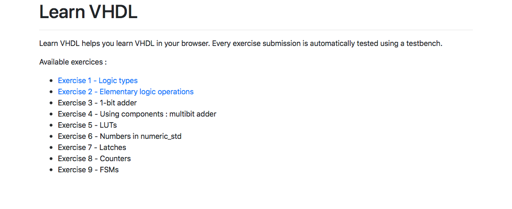
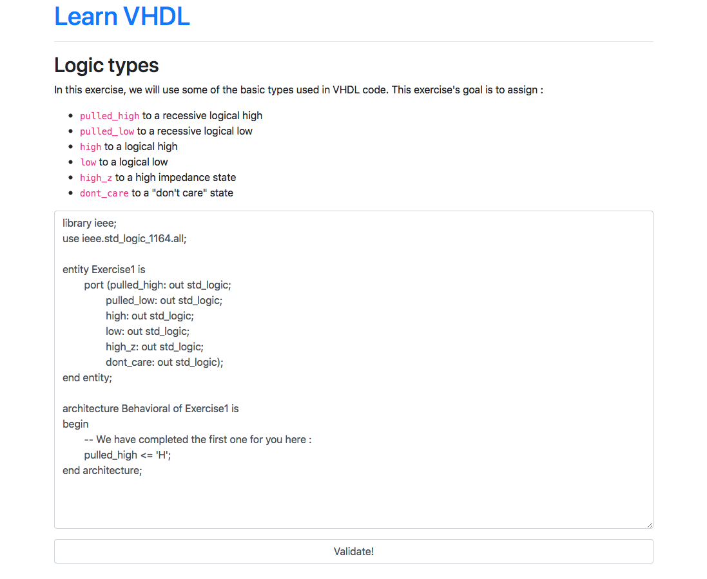
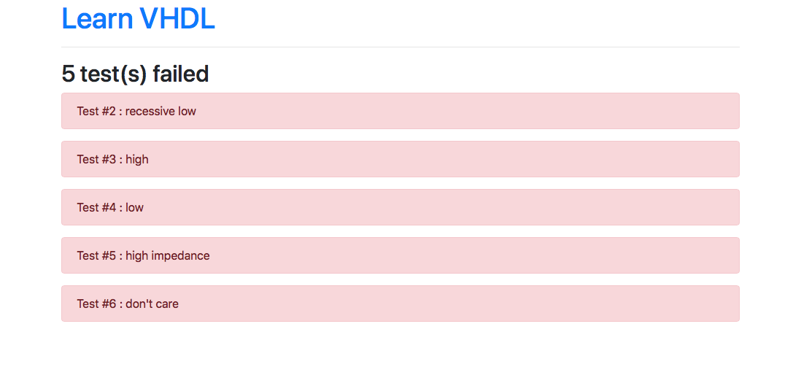

# Learn VHDL

**This project is a mess, please consider a complete rewrite before pushing to production :-)**

Learn VHDL is a VHDL learning tool. Few testbench scenarios are run on the student's code to check if its code is correct. It is greatly inspired by [Prologin's](https://prologin.org) qualification system.

## How to

```
sudo dnf install ghdl / sudo apt-get install ghdl / sudo whatever install ghdl / or simply make a ghdl executable accessible from $PATH
gem install sinatra
ruby learnvhdl.rb
```

Then open your favorite web browser to **http://localhost:4567/**

## Screenshots






